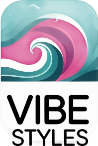

<p align="center">
  <a href="README.md"><strong>🇧🇷 Clique aqui para a versão em Português</strong></a>
</p>

<br>

<p align="center">
  
</p>

<h1 align="center">🎨 Vibe Styles</h1>

<p align="center">
  Interactive collection with <strong>256 UI/UX design styles</strong> — each with a live visual demo and a copyable prompt for generative AI.
</p>

<p align="center">
  <a href="https://vibe.ft.ia.br/">🌐 Live Demo</a> ·
  <a href="https://github.com/fabricioctelles/vibe-styles">💻 GitHub</a> ·
  <a href="#-categories">📂 Categories</a> ·
  <a href="#-how-to-use">🚀 How to Use</a> ·
  <a href="#-full-catalog">📋 Catalog</a> ·
  <a href="#-contributing">🤝 Contributing</a> ·
  <a href="README.md">🇧🇷 Português</a>
</p>

<p align="center">
  <a href="https://github.com/fabricioctelles/vibe-styles/stargazers"></a>
  
  
  
  
  
</p>

---

## 📖 About the Project

**Vibe Styles** is an **interactive collection with 256 UI/UX design styles — each with a visual demo + a copyable prompt ready to paste into ChatGPT, Claude, Gemini, or any generative AI.**

The project gathers 256 design styles — from Glassmorphism to Cyberpunk, from Brutalism to Kawaii — each implemented as a standalone landing page with HTML, Tailwind CSS, and Alpine.js.

### The Differentiator

- ✅ **Copy-paste ready prompts** — Each style comes with a structured and tested prompt for generative AI
- ✅ **Functional visual demo** — Not a mockup — each style is a complete, responsive HTML page
- ✅ **No design decisions needed** — Comes with color palette, typography, spacing, and execution rules
- ✅ **For 4 different personas** — Developers, No-code Designers, Agencies, Content Creators (Gamma, Pitch, Lovable, NotebookLM)

### Inspiration

It all started with a [Reddit post](https://www.reddit.com/r/notebooklm/comments/1r2p1bb/40_notebooklm_infographic_styles_specification/) by [Paolo Cortez](https://www.reddit.com/user/Paolo-Cortez/), who shared a collection of infographic style prompts for NotebookLM. The specifications were so well-structured — with color palettes, typography, textures, and tags — that they could easily serve as style specifications for landing pages.

This reminded me of [ui-ux-pro-max](https://github.com/nextlevelbuilder/ui-ux-pro-max-skill), a skill that also maintains a [curated list of UI/UX styles](https://github.com/nextlevelbuilder/ui-ux-pro-max-skill/blob/main/src/ui-ux-pro-max/data/styles.csv) focused on practical implementation.

I also used [Manus AI](https://manus.im/app) to evolve the lists, jumping from 89 to over 200 styles.

I merged the sources and used [Kiro](https://kiro.dev) with multi-agents to generate dynamic prompts and create nearly 200 demo pages in an automated way.

I also tested it on [Cline](https://cline.bot/) and [Claude Code](https://claude.com/product/claude-code) and it worked great too.

The intention is to be simple and straightforward: help you choose the right style for your SaaS or weekend project.

### Why does Vibe Styles exist?

- **Quick reference** — Visually browse 256 styles without leaving your browser
- **Ready-made prompts** — Copy and paste into any generative AI to replicate the style
- **Real code** — Each style is a functional implementation, not just a mockup
- **Zero dependencies** — Static HTML + Tailwind CDN + Alpine.js + Google Fonts. No build, no compilation
- **SEO-friendly** — Semantic slug URLs, Schema Markup JSON-LD, Open Graph, sitemap, NGINX optimized for Coolify

---

## 🏗 Application Architecture V2

### Project Structure

```
vibe-styles/
├── app/
│   ├── index.html                    # Main page (grid + sticky header + infinite scroll)
│   ├── detail.html                   # Detail page (70% iframe + 30% prompt with tabs)
│   ├── data/
│   │   └── data.json                 # Centralized JSON with all 256 styles
│   ├── styles/
│   │   ├── 1.html                    # Design iframes (one per style)
│   │   ├── 2.html
│   │   └── [id].html                 # Total: 256 files
│   ├── assets/
│   │   ├── images/
│   │   │   ├── logo.svg              # Application logo
│   │   │   └── [screenshots]         # 16:9 style previews
│   │   ├── css/
│   │   │   └── animations.css        # Custom animations
│   │   └── js/
│   │       ├── config.js             # Global settings
│   │       ├── utils.js              # Helpers (generateSlug, findCardBySlug, dark mode)
│   │       └── detail.js             # Slug routing (parseRoute, loadStyleData)
│   ├── screenshots/                  # Style image directory
│   │   ├── 1.png                     # Dark Mode (OLED)
│   │   ├── 2.png
│   │   └── [id].png                  # One image per style
│   ├── llms.txt                      # AI metadata
│   ├── sitemap.xml                   # SEO sitemap (slug URLs)
│   └── robots.txt                    # Crawler control
└── nginx.conf                        # NGINX config for Coolify (slug rewrite)
```

### Two Entry Points

| Page | Function | Features |
|------|----------|----------|
| **index.html** | Visual catalog | Responsive grid 4/3/2/1 cols, poster-style cards, sticky header, infinite scroll (16 cards/load) |
| **detail.html** | Detailed view | 70/30 layout (iframe + prompt), mobile responsive, slug routing (`/{slug}`) with `?id=` fallback |

### Data Flow

```
app/data/styles.json (fetch once)
    ↓
Alpine.js state (declarative reactivity)
    ↓
Real-time filter/search (~2ms)
    ↓
Reactive rendering (cards mount with stagger animation)
    ↓
Intersection Observer (scroll detection)
    ↓
Load 16 additional cards
    ↓
Images src: app/screenshots/[id].png
```

### Routing

- **Home**: `index.html` — Grid of all 256 styles
- **Detail**: `/{slug}` — Specific style with iframe + prompt (e.g., `/glassmorphism`)
- **Fallback**: `detail.html?id=[id]` — Backward compatibility, redirects to slug via `history.replaceState`
- **Iframes**: `app/styles/[id].html` — Visual style demo
- **Data**: `app/data/data.json` — Single source of truth

**Slug routing** — SEO-friendly URLs dynamically generated from the style name. NGINX rewrites `/{slug}` to `detail.html`, where JavaScript resolves the slug via `parseRoute()` + `findCardBySlug()`. Legacy URLs with `?id=` continue to work with transparent redirect.

---

## 🎨 Interface & Design

### Sticky Header

```
┌────────────────────────────────────────────────────────────────────────────┐
│ [Logo] Vibe Styles  |  [🔍 Search] [Filters]  |  [🌙] [⭐ GitHub] [Logo ft] │
└────────────────────────────────────────────────────────────────────────────┘
```

**Components:**
- **Logo**: Application with name "Vibe Styles"
- **Search**: Input with debounce (Alpine.js) — filters in real-time by any JSON field
- **Filters**: Dropdown with categories (General, Landing Page, BI/Analytics, etc.)
- **Dark Mode Toggle**: Sun/moon icon that rotates 180°, persists in localStorage
- **GitHub Stars Badge**: `https://img.shields.io/github/stars/fabricioctelles/vibe-styles`
- **Link ft.ia.br**: Small logo (20px) linking to https://ft.ia.br/

**Behavior:**
- `position: sticky; top: 0; z-index: 50`
- Backdrop blur with semi-transparent background
- Responsive: on mobile, some elements are hidden

### Card Grid (Home)

**Responsiveness:**
```
Desktop (>1440px):  4 columns
Laptop (>1024px):   3 columns
Tablet (>640px):    2 columns
Mobile:             1 column
```

**CSS:**
```css
display: grid;
grid-template-columns: repeat(auto-fill, minmax(280px, 1fr));
gap: 16px;
padding: 2rem;
```

### Individual Card (Poster Style)

**Layout:**
```
┌─────────────────────────────────┐
│ ┌─────────────────────────────┐ │  ← 16:9 image with overlay
│ │ [Style Screenshot]          │ │
│ │ (app/screenshots/[id].png)  │ │     
│ │                             │ │     Gradient overlay (bottom-up)
│ │ ┌───────────────────────┐   │ │     Badge: "General" top-left
│ │ │ General (Category)    │   │ │
│ │ └───────────────────────┘   │ │
│ │                             │ │
│ │ 📌 Glassmorphism (Title)    │ │  ← Text overlay bottom-left
│ │    (white text, shadow)     │ │
│ └─────────────────────────────┘ │
│  Rounded: 24px (rounded-2xl)    │
│  Aspect: 16:9                   │
│  Hover: Scale 1.05, rotate -1°  │
└─────────────────────────────────┘
```

**Visual Style:**
- Rounded corners: `rounded-2xl` (24px)
- Aspect ratio: 16:9 responsive
- Image: `app/screenshots/[id].png` as background
- Overlay gradient: `linear-gradient(to top, rgba(0,0,0,0.6), rgba(0,0,0,0))`
- Title: Positioned top-left over the image, white with text-shadow
- Category badge: Top-left corner

**Interactions:**
- **Hover**:
  - Image: scale 1.05 (smooth zoom)
  - Card: rotate -1deg (slight tilt)
  - Shadow: increases to `0 20px 40px rgba(0,0,0,0.15)`
  - Arrow icon "→" appears top-right (opacity: 0 → 1)
  - Background darkens slightly

- **Click**:
  - Navigates to `detail.html?id=[id]`
  - Cursor `pointer`

- **Mount (Staggered Animation)**:
  - Fadeup: `opacity 0 → 1` + `translateY(20px) → 0`
  - Duration: 300ms easing
  - Delay: `calc(index * 50ms)` based on position

**Accessibility:**
- Semantics: `<article>` or `<a>` tag
- `aria-label`: "View style [name]"
- Focus ring: `focus:ring-2 ring-offset-2`
- Alt text on image

### Infinite Scroll

**Mechanism:** Intersection Observer API

```javascript
const sentinel = document.querySelector('[data-sentinel]');
const observer = new IntersectionObserver((entries) => {
  if (entries[0].isIntersecting && !isLoading) {
    loadMoreCards(16);
  }
}, { rootMargin: '400px' });
observer.observe(sentinel);
```

**Behavior:**
- Loads 16 cards at a time
- When the user scrolls near the end, loads more automatically
- Loading spinner while fetching
- End message when reaching 256 styles: "🎉 End of collection!"

---

## 📄 Detail Page

### Desktop (70/30 Layout - Full Height)

```
┌──────────────────────────────────────────────────────┐
│ ← Prev Style        Home        Next Style →         │ Header nav
├──────────────────────────────────────────────────────┤
│ Vibe Styles / Glassmorphism                          │ Breadcrumb
│ Glassmorphism   [General] [frosted] [blur] [2022+]   │ Title + tags
├──────────────────────────────────┬───────────────────┤
│                                  │ [Prompt][Origin]  │ Pill-style tabs
│   Iframe (70%)                   │ [Usage] [Similar] │ (active = purple)
│   app/styles/[id].html           │─────────────────  │
│                                  │ AI Prompt         │ Tab header
│                                  │─────────────────  │
│                                  │ [📋 Copy]         │ Button at top
│                                  │─────────────────  │
│                                  │ ## INSTRUCTION... │
│                                  │ Act as a...       │ Content with
│   [Open in new tab]              │ (scroll)          │ scroll
└──────────────────────────────────┴───────────────────┘
Footer: © 2026 FABRICIO TELLES · FT.IA.BR
```

### Right Panel Tabs

| Tab | Content |
|-----|---------|
| **Prompt** | "Copy Full Prompt" button at top + copyable prompt with scroll + description |
| **Origin** | History and context of the style's origin |
| **Usage** | Recommended use cases |
| **Similar** | Related styles with slug navigation links |

Tabs use pill style with `--color-accent` (purple) highlight on the active tab. All tab content has independent scroll.

### Mobile (Responsive Full-Width)

```
┌─────────────────────────────────────────────┐
│ ← Vibe Styles › Glassmorphism               │
├─────────────────────────────────────────────┤
│ Iframe 100% Width, Full Height              │
│                                             │
│ [📋 Copy Prompt] (Floating bottom-right)    │
│                                             │
└─────────────────────────────────────────────┘
```

**Behavior:**
- On desktop: side-by-side 70/30 layout with pill-style tabs in the right panel
- On mobile: fullscreen iframe, prompt as floating button
- Prev/next navigation and related styles use slug URLs
- "Copy Prompt" button with visual feedback ("✓ Copied!" for 2 seconds)
- SEO meta tags (canonical, og:url, Schema JSON-LD, breadcrumbs) use slug URLs

---

## 🌓 Dark Mode & Customization

### Dark Mode Toggle

**Implementation:**
- **Icon**: Sun ☀️ (light) / Moon 🌙 (dark)
- **Animation**: Smooth 180° rotation on toggle
- **Persistence**: localStorage (`vibe-styles-theme`)
- **Application**: `.dark` class on `<html>` or `<body>`

**Colors:**

```css
:root {
  --page-bg: #F5F5F7;          /* Light: Very light gray ≈ Apple Gray */
  --card-bg: #FFFFFF;           /* Light: Pure white */
  --text-primary: #1d1d1f;      /* Light: Very dark black ≈ Apple Black */
  --text-secondary: #6e6e73;    /* Light: Medium gray */
  --accent: #8B5CF6;            /* Purple (same in both themes) */
}

.dark {
  --page-bg: #1a1a1a;          /* Dark: Deep black ≈ Apple OLED Black */
  --card-bg: #2d2d2d;           /* Dark: Very dark gray */
  --text-primary: #f5f5f7;      /* Dark: Very light white ≈ Apple White */
  --text-secondary: #a1a1a6;    /* Dark: Medium light gray */
  --accent: #8B5CF6;            /* Purple (same) */
}
```

**Transition:**
- All elements with `transition: background-color 0.3s, color 0.3s`
- Smooth without jarring

---

---

## 🗂 Categories

The collection is organized into **25 categories** covering the main design scenarios:

| Category | Qty | Description | Badge |
|----------|-----|-------------|-------|
| **General** | 110 | General-purpose interface styles — modern and classic trends | 🟣 |
| **Landing Page** | 8 | Patterns optimized for conversion and sales pages | 🟢 |
| **BI/Analytics** | 10 | Corporate dashboards and data visualization | 🟡 |
| **Organization** | 1 | Organizational and corporate styles | 🔵 |
| **Infographic** | 13 | Visual styles for infographics and information presentation | 🔴 |
| **Tech-Inspired** | 20 | Styles inspired by major tech companies | 🔵 |
| **Thematic** | 11 | Thematic styles with strong visual identity | 🟠 |
| **Technical** | 8 | Technical and specialized styles | 🔵 |
| **Data Visualization** | 1 | Specialized data visualization | 🟡 |
| **Artistic** | 3 | Artistic and expressive styles | 🟣 |
| **Historical** | 5 | Styles inspired by historical periods | 🟤 |
| **Fantasy** | 1 | Fantasy and imaginary world styles | 🟣 |
| **Casual** | 1 | Casual and laid-back styles | 🟢 |
| **Futuristic** | 8 | Futuristic and sci-fi styles | 🔵 |
| **Pop Culture** | 9 | Styles inspired by pop culture, movies, and series | 🟣 |
| **Retro** | 6 | Retro and nostalgic styles | 🟠 |
| **Educational** | 1 | Educational and didactic styles | 🔵 |
| **Minimalism** | 5 | Clean and functional minimalist styles | ⚪ |
| **Brutalism** | 5 | Bold and direct brutalist styles | ⚫ |
| **Constructivism** | 5 | Geometric and structured constructivist styles | 🔺 |
| **SwissStyle** | 5 | Swiss Design styles with typography and grid | 🟥 |
| **EditorialStyle** | 5 | Editorial styles inspired by magazines and publications | 📰 |
| **HandDrawn** | 5 | Handcrafted and organic hand-drawn styles | ✏️ |
| **FlatDesign** | 5 | Clean and two-dimensional flat design styles | 🔷 |
| **BentoStyle** | 5 | Bento styles with modular grid layout | 🍱 |

---

## 🚀 How to Use

### Flow: Choose Style → Copy Prompt → Paste in AI

#### 1️⃣ **Access the catalog**
Go to **[vibe.ft.ia.br](https://vibe.ft.ia.br/)** (or run locally — see "Local Setup" below)

#### 2️⃣ **Choose the ideal style**
- Use the dropdown to browse through 256 styles
- **Tip**: search by category (General, Landing Page, BI/Analytics) or project type:
  - 🏢 For **SaaS B2B**: Minimalism, Swiss Style, Glassmorphism, Dark Mode OLED
  - 🛒 For **Ecommerce**: Vibrant & Block-based, Flat Design, Bento Grid
  - 🚀 For **High-impact Landing Page**: Glassmorphism, Aurora UI, 3D & Hyperrealism
  - 📊 For **Dashboard/Analytics**: Data-Dense, Executive Dashboard, Real-Time Monitoring
  - ✨ For **Portfolio/Creative**: Editorial Grid, Hand-Drawn, Claymation 3D
  - 🎮 For **Community/Gen-Z**: Y2K Aesthetic, Cyberpunk UI, Kawaii

#### 3️⃣ **View the demo**
The style is displayed in real-time in the central panel (responsive iframe). Analyze colors, typography, spacing, and animations.

#### 4️⃣ **Copy the prompt**
Click the **"Copy Prompt"** button (top-right corner). The structured prompt will be copied to your clipboard.

#### 5️⃣ **Paste in your preferred AI**
- **ChatGPT** (chat.openai.com)
- **Claude** (claude.ai)
- **Gemini** (gemini.google.com)
- **Lovable** (lovable.dev) — to generate complete code
- **Gamma** (gamma.app) — for presentations
- **Pitch** (pitch.com) — for decks
- **NotebookLM** (notebooklm.google.com) — to generate audio + slides
- Any other AI that accepts prompts

#### 6️⃣ **Customize and adapt**
The prompt brings complete specifications (colors, typography, layout, components). You can adapt:
- Theme/context ("For a design agency", "For an AI SaaS")
- Specific sections (remove Testimonials, add FAQ)
- Text content (headlines, feature descriptions)
- Colors (keep the style, swap the palette)

---

### Local Setup

```bash
# Clone the repository
git clone https://github.com/fabricioctelles/vibe-styles.git
cd vibe-styles

# Option 1: Simple server (no slug URL support)
python3 -m http.server 8000 --directory app
# Access http://localhost:8000 — navigation works, but slug URLs return 404

# Option 2: Dev server with slug rewrite (recommended)
python3 scripts/dev-server.py 8001
# Access http://localhost:8001 — URLs like /glassmorphism work correctly
```

The dev server (`scripts/dev-server.py`) simulates NGINX behavior, rewriting slug URLs to `detail.html`.

---

## ❓ FAQ — Persona Mapping and Use Cases

### 👨‍💻 Are you a Developer using AI as a design tool?

**Your problem**: "I'm stuck on design decisions. I don't want to waste time with CSS, colors, and typography."

**Solution with Vibe Styles**:
1. Choose a style in Vibe Styles (e.g., "Glassmorphism" or "Dark Mode OLED")
2. Copy the structured prompt
3. Paste in ChatGPT/Claude → it generates complete HTML/CSS with a defined design system
4. Customize only the business logic (API, database, authentication)

**Recommended styles**: Minimalism & Swiss Style, Glassmorphism, Dark Mode OLED, Neumorphism, Accessible & Ethical

---

### 🎨 Are you a Designer without front-end skills?

**Your problem**: "I have design ideas, but I can't code. Tools like Figma take too long."

**Solution with Vibe Styles**:
1. Browse the 256 styles for inspiration
2. Copy the prompt from a style similar to your concept
3. Customize the prompt (colors, fonts, sections)
4. Paste in Lovable (lovable.dev) or Claude → it generates complete code
5. You get ready-made HTML/CSS that you can hand off to a dev team

**Recommended styles**: Claymorphism, Aurora UI, 3D & Hyperrealism, Bento Box Grid, Hand-Drawn Sketch

---

### 🏢 Are you an Agency that needs fast delivery?

**Your problem**: "My clients expect landing pages in 1-2 weeks, but each project requires design decisions from scratch. That's expensive."

**Solution with Vibe Styles**:
1. Use Vibe Styles as a shared design system with clients
2. Choose 3-5 base styles (e.g., Minimalism for B2B, Vibrant Block-based for ecommerce)
3. Copy the prompt, customize for the client
4. Generate with AI → you gain 60-70% speed
5. Design team refines details (copywriting, images, optimizations)

**Recommended styles by sector**:
- **Fintech/Data**: Executive Dashboard, Data-Dense, Financial Dashboard
- **SaaS B2B**: Swiss Style, Minimalism, Glassmorphism, Accessible & Ethical
- **Ecommerce**: Vibrant & Block-based, Bento Grid, Y2K Aesthetic
- **Healthcare**: Accessible & Ethical, Organic Biophilic, Serene Minimalism
- **Education**: Chalkboard, Hand-Drawn, Kawaii, Educational Flat Design

---

### 📱 Are you a Content Creator (Gamma, Pitch, Lovable, NotebookLM)?

**Your problem**: "I need to create presentations, infographics, and landing pages with a coherent visual, but generic templates aren't enough."

**Solution with Vibe Styles**:
1. Use Vibe Styles prompts with **Gamma** (for presentations) or **Pitch** (for decks)
2. Use with **NotebookLM** to generate infographics + structured audio
3. Use with **Lovable** for landing pages
4. **Result**: all visual content follows the same style = coherent brand

**Recommended styles**:
- **Presentations**: Gradient Mesh, Editorial Grid, Geometric, Aurora Borealis
- **Infographics**: Radial Diagram, Timeline Horizontal, Z-Shape, Sakura/Floral
- **Landing Pages**: Hero-Centric, Conversion-Optimized, Feature-Rich Showcase
- **Narrative/Storytelling**: Parallax Storytelling, Editorial Grid, Ghibli-Inspired

---

### ❓ "Which style to choose for SaaS B2B vs Ecommerce?"

| Use Case | Recommended Styles | Why |
|----------|-------------------|-----|
| **SaaS B2B** (Enterprise, Risk-averse) | Minimalism & Swiss Style, Dark Mode OLED, Glassmorphism, Accessible & Ethical | Trust, seriousness, credibility |
| **SaaS B2C** (Young, tech-forward) | Aurora UI, Glassmorphism, Bento Grid, 3D & Hyperrealism | Modern, dynamic, engaging |
| **Ecommerce** (High conversion) | Vibrant & Block-based, Y2K Aesthetic, Productive Flat Design, Bento Grid | Attention-grabbing, product highlight |
| **Fintech** (Trust + innovation) | Executive Dashboard, Swiss Modernism 2.0, Secure Minimalism, Material AI | Professional + future |
| **Education** (Friendly, playful) | Chalkboard, Hand-Drawn, Kawaii, Educational Flat Design | Welcoming, creativity |
| **SaaS Dev** (Tech-forward) | Blueprint Engineering, HUD/Sci-Fi UI, Circuit Board PCB, Brutalist | Technical, dev credibility |
| **Portfolio/Creative** (Stand out) | Claymation 3D, Hand-Drawn, Editorial Grid, Ghibli-Inspired | Personal creativity, different |
| **Sales Landing Page** (High CTR) | Hero-Centric, Conversion-Optimized, Social Proof-Focused, Trust & Authority | Reader-directed, psychology-driven |

---

### ❓ "I'm stuck on design decisions. What does it solve?"

**Problem**: You know you need a landing page, but you're paralyzed:
- "What colors to use?" ❌ → ✅ Vibe Styles defines complete palette + variations
- "What font?" ❌ → ✅ Typography + hierarchy already defined
- "What layout?" ❌ → ✅ Section structure already mapped
- "What animations?" ❌ → ✅ Style-specific visual effects
- "How to space?" ❌ → ✅ Design system with gap, padding, margin variables

**Result**: you jump straight to implementation. AI generates the base. You customize content.

---

### ❓ "My AI prompt doesn't work. How does Vibe Styles help?"

**Current problem**:
```
"Create me a beautiful landing page"
→ AI returns something generic, without consistent visual identity
```

**With Vibe Styles**:
```
[Copy the complete Glassmorphism style prompt from Vibe Styles]
"Create me a landing page for an AI SaaS using the style defined in the prompt..."
→ Result: landing page with clear visual identity, coherent colors, defined typography
```

**Why it works better**:
- ✅ Prompt structured in sections (Style → Colors → Typography → Layout → Checklist)
- ✅ Technical specifications (CSS, design system variables)
- ✅ Validation checklist (WCAG, responsiveness, hover states)
- ✅ Clear execution rules (no room for ambiguity)

---

### ❓ "Do all styles include ready-made prompts?"

Yes. All 256 styles include:
- ✅ Live visual demo (responsive HTML)
- ✅ Structured and tested prompt
- ✅ Color palette (primary, secondary, accents)
- ✅ Typography (fonts, sizes, hierarchy)
- ✅ Technical specifications (CSS, design system, variables)
- ✅ Validation checklist
- ✅ Execution rules for AI to follow

---

### ❓ "Can I use the styles with Lovable, Gamma, Pitch, or NotebookLM?"

**Yes.** The prompt is agnostic — it works in any tool that accepts text instructions:

| Tool | Usage | Result |
|------|-------|--------|
| **ChatGPT/Claude** | Paste the prompt → generates HTML/CSS | Code-ready landing page |
| **Lovable** | Paste the prompt → generates interactive app | Live + deployable landing page |
| **Gamma** | Paste the prompt in "Custom style" | Presentation with coherent visual style |
| **Pitch** | Paste the prompt in context | Deck with visual identity |
| **NotebookLM** | Paste as Instructions for Infographic + audio + slides generation | Personalized generations |
| **Gemini** | Activate "CANVA" mode, paste the prompt | Ready-made landing page |

---

### ❓ "How do I choose among 256 styles?"

Use this decision tree:

```
1. What is your Use Case?
   → SaaS B2B? → Minimalism, Swiss, Glassmorphism
   → Ecommerce? → Vibrant, Bento, Flat Design
   → Sales Landing Page? → Hero-Centric, Conversion-Optimized
   → Portfolio/Creative? → Hand-Drawn, Claymation, Editorial Grid
   → Dashboard/BI? → Executive Dashboard, Data-Dense, Real-Time Monitoring
   → Infographic? → Radial Diagram, Geometric, Sakura

2. Who is your audience?
   → Risk-averse (Enterprise, Financial)? → Dark, Swiss, Accessible
   → Tech-forward (Devs, Startups)? → Glassmorphism, 3D, Cyberpunk, Blueprint
   → Young/Gen-Z? → Y2K, Kawaii, Cyberpunk, Vaporwave
   → Creative/Artistic? → Hand-Drawn, Claymation, Ghibli-Inspired

3. What mood do you want?
   → Minimalist and trustworthy? → Minimalism, Swiss
   → Modern and dynamic? → Glassmorphism, Aurora, 3D
   → Creative and playful? → Hand-Drawn, Kawaii, Claymation
   → Technical and precise? → Blueprint, PCB, HUD/Sci-Fi
   → Nostalgic and retro? → Vintage, Retro Travel, 8-Bit
   → Futuristic? → Cyberpunk, Holographic, Glitch UI

Once you choose → copy the prompt → customize for your context.

TIP: Use the search — it covers all style fields
 (categories, keywords, description, etc.)
```

---

## Style List

You can find it in the `ESTILOS.md` file.

## 🔗 URL Structure

The project uses semantic SEO-friendly slug URLs:

| Pattern | Example | Description |
|---------|---------|-------------|
| `/` | `vibe.ft.ia.br/` | Main page (gallery) |
| `/{slug}` | `vibe.ft.ia.br/glassmorphism` | Style detail page |
| `/detail.html?id=N` | `/detail.html?id=3` | Backward-compatible fallback (redirects to slug) |
| `/styles/{id}.html` | `/styles/3.html` | Style demo iframe |
| `/data/data.json` | `/data/data.json` | JSON database with all styles and prompts |
| `/llms.txt` | `/llms.txt` | AI crawler metadata |
| `/sitemap.xml` | `/sitemap.xml` | XML sitemap for search engines |

Slugs are dynamically generated by the `generateSlug()` function in `utils.js`:
- Accents are transliterated to ASCII (`ê` → `e`)
- Special characters are removed (`&`, `/`, `()`)
- Spaces become hyphens (`Dark Mode (OLED)` → `dark-mode-oled`)
- Legacy URLs (`detail.html?id=3`) transparently redirect to the slug via `history.replaceState`

### NGINX Routing (Coolify)

The `nginx.conf` file at the project root configures routing for Coolify deployment:
- `/{slug}` → serves `detail.html` (JavaScript resolves the slug)
- `/styles/*.html` → serves static iframe files
- Assets with long cache (1 year) and gzip enabled

### Local Development Server

To test slugs locally (without NGINX), use the dev server with rewrite:

```bash
python3 scripts/dev-server.py 8000
```

Access `http://localhost:8001/glassmorphism` — the server rewrites slug URLs to `detail.html`.

---

## 🤖 AI Integration

Vibe Styles was designed to work as a bridge between visual reference and generative AI:

### Usage Flow

```
1. Browse the catalog → 2. Find the ideal style → 3. Copy the prompt → 4. Paste in AI → 5. Generate your design
```

### Prompt Format

Each style has a structured prompt containing:

- **Header**: Contextual instructions for the AI (role, task, customizable fields)
- **Style**: Name, type, and keywords of the style
- **Palette**: Primary, secondary, and accent colors
- **Typography**: Main fonts, sizes, and hierarchy
- **Layout**: Section structure, spacing, and organization
- **Visual Elements**: Borders, shadows, animations, and details
- **Tags**: Semantic classification of the style

### Usage Example

```markdown
# In ChatGPT/Claude/Gemini

User: [Paste the "Glassmorphism" style prompt]

AI: [Generates complete HTML/CSS code in Glassmorphism style]
```

---

## 🛠 Tech Stack

| Technology | Usage |
|------------|-------|
| HTML5 | Semantic structure with Alpine.js directives |
| Alpine.js | Declarative reactivity (v3.x, ~15KB) |
| JavaScript vanilla | Custom utils (generateSlug, findCardBySlug, parseRoute, localStorage persistence) |
| Google Fonts | Typography (Inter) |
| JSON | Centralized style and prompt database |

**Zero build tools**, **zero webpack/vite**, **zero npm dependencies**. Pure static files that run on any HTTP server with Alpine.js via CDN.

### Why Alpine.js?

✅ **Declarative reactivity via HTML** — Less JavaScript boilerplate  
✅ **Built-in debounce** — Perfect for real-time search/filters  
✅ **Performance** — <2ms difference compared to Vanilla JS  
✅ **HTML-first philosophy** — Keeps HTML semantic and readable  
✅ **No compilation** — Works directly from the `.html` file

---

## 📊 Project Numbers

| Metric | Value |
|--------|-------|
| Total styles | 256 |
| Categories | 25 |
| Style HTML files | 256 (expanding) |
| Build dependencies | 0 |
| JavaScript frameworks | 0 |
| Shell size (index.html) | ~815 lines |
| Database | `data.json` (~4300 lines) |

---

## 📐 Technical Specifications

Each demo landing page follows the standard:

| Aspect | Specification |
|--------|---------------|
| Responsive | 375px to 1440px |
| Navbar | None (displayed inside iframe) |
| Size | ~300 lines max |
| Sections | Hero, Features (3), Testimonials (3), Pricing (3 tiers), CTA, Footer |
| Accessibility | `prefers-reduced-motion`, alt text, labels |

---

## 🗓 Changelog

- **February 2026** — Semantic slug URLs (`/glassmorphism` instead of `?id=3`). NGINX configuration for Coolify. Local dev server with slug rewrite. Pill-style tabs in the prompt panel (Prompt, Origin, Usage, Similar) with independent scroll. "Copy Prompt" button moved to the top of the box. Slug collision fixes (IDs 140 and 166 renamed). Sitemap, llms.txt, and SEO meta tags updated for slug URLs.
- **February 2026** — Expansion to 256 styles in 25 categories. Addition of new specialized categories (Minimalism, Brutalism, Constructivism, SwissStyle, EditorialStyle, HandDrawn, FlatDesign, BentoStyle) and Brazilian thematic styles. Full migration to `data.json`. Updated `sitemap.xml` and `llms.txt`.
- **February 2026** — Migration of prompts from individual `.txt` files to centralized `data.json`. New `DataLoader` in `index.html`. Addition of 90 new styles (Tech-Inspired, Thematic, Technical, Futuristic, Pop Culture, Historical, Artistic). `generate_html.py` script for automated LLM generation.
- **February 2026** — Initial launch with 98 styles, 4 categories, full SEO, AI integration

---

## 🤝 Contributing

Contributions are welcome! Some ways to contribute:

- 🎨 Suggest new UI/UX styles
- 🐛 Report bugs or inconsistencies
- 📝 Improve documentation
- 💻 Implement missing style HTMLs
- ✨ Optimize existing prompts

---

## 🙏 Acknowledgments

- **[ui-ux-pro-max](https://github.com/nextlevelbuilder/ui-ux-pro-max-skill)** — For the skill with the curated list of UI/UX styles, palettes, typography, and implementation guidelines that complemented the project's style base.

- **[Manus AI](https://manus.im/app)** — For generating the new prompts (above ID 89, all generated by it)

- **[Paolo Cortez](https://www.reddit.com/user/Paolo-Cortez/)** — For the original collection of infographic styles for NotebookLM that inspired some prompts in this project.

---

<p align="center">
  Made with 💜 by <a href="https://ft.ia.br">ft.ia.br</a> with the help of <a href="https://kiro.dev">Kiro</a><br>
  
</p>
